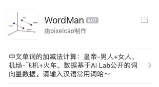

# 感受 AI 之美——Word2Vec 之旅

[TOC]

去年，AI Lab 公开了一份“[大规模高质量中文词向量数据](https://ai.tencent.com/ailab/nlp/embedding.html)”，使用腾讯新闻、天天快报和百科词条作为语料，训练出的词向量模型。这份数据填补了中文词向量数据的空白。

这次，二葱单纯从实践的角度，试玩一下这份数据。用这份词向量数据，制作一个“单词加减计算器”，来瞻仰一下数学之美、Word2Vec 之美，以及无监督训练出来的模型，竟然能如此令人大呼**卧槽**地体现出现实世界之间千丝万缕的联系。等不及的，可以直接翻到最后看翻车现场=。=

## 主要困难

AI Lab 开源的这份数据，重达 6GB，解压后有 16GB。使用这份数据，需要一台**内存足够大**的机器，比如一台 M10 型号（12 核 128GB 内存）的物理机——抱运维大大的大腿，求一台！

其次，公司 IDC 机器申请外网访问比较麻烦，tlinux 上的软件源版本陈旧，而且安装部分科学运算的 python 库（比如 numpy 和 annoy）时还需要当场编译 C++ 模块，用膝盖思考一下就知道**环境配置**这里面肯定有坑！

最后，python 装好了、gensim 也学会了，但数据量级实在太大，每次取最近邻要挨个暴力运算 800 条词汇的 200 维向量距离，如何在**常量时间**内取得一定精度的结果呢？

等等，长时间的模型训练总不能一直盯着它吧？还得想个办法既能让电脑努力地运算、又能主动通知关键流程的错误码才行——这样才能边工作边上上某 Hub 划**划水**啊！

## 基本原理

一句话解释 Word2Vec：

- Word2Vec 可以得到汉语单词的数字表达
- 这份数据里，使用 200 维的向量来描述 800 万条词汇
- 人通过象形符号和生活记忆来区分不同的词汇，机器通过向量之间的距离来区分不同的词汇

由于 Word2Vec 太过出名，资料有很多就不展开了，它主要包含两个模型：

- 连续词袋（CBOW）模型：用上下文预测当前词
- Skip-gram 模型：用当前词预测上下文

怎样体会 Word2Vec 的数学含义呢？我们想象一个三位坐标系，每个点代表一个单词，我们取两个点画一条有方向的线段，然后任取空间内另外一点，叠加上刚才的平行线。


看到了吗？国王(king) -> 皇后(queen) 和 男人(man) -> 女人(woman) 是平行且等长的，也就意味着：

> 国王 - 皇后 = 男人 - 女人

根据加法交换律：

> 国王 - 男人 + 女人 = 皇后

我们有告诉计算机国王是男人、皇后是女人吗？没有——这个模型是**无监督**得到的。

那么为什么能得到这么有现实含义的等式？“一个人是由他所在环境塑造的”——这就是**上下文**预测。

明白这些之后，只需要再有一些数学基础，就不难理解 Word2Vec 的原理了。

## 上手实践

上面提出的“主要困难”，其实都是真正上手实践的时候遇到的问题。

首先是内存问题，起初我以为 6 核 16GB 内存的 MacBook 能 hold 的住 16GB 大小的数据集。后来才知道我想多了，系统保留 2GB、Chrome 吃掉 2GB、VSCode 吃掉 4GB，剩下的哪够 16GB 啊……再加上 256GB 的存储，剩余空间少的可怜，数据加载到一半，磁盘剩余空间 1MB 都不到了——虚拟内存都无从分配。mem alloc failed，程序崩溃。

然后打算用一台 M10 机型来加载模型，M10 机器内存够大，可以尽情浪费。此时脑海中回想起环境配置的痛苦，直觉告诉我——如果不用 docker 你就等着一下午浪费在环境配置上吧～

在计算复杂度上，gensim 计算一个向量和所有向量的相似度时，需要遍历每个向量，虽然复杂度是 O(n) 但也架不住八百万条数据啊……所以二葱使用了 spotify 公司开源的 `annoy` 框架。

用 `annoy` 使用二叉树构建 200 维的高维空间，可以通过牺牲精度来换取比暴力搜索更快的搜索速度。这样复杂度就由 O(n) 减少到 O(logN) 了。


最后是要一直盯着控制台等结果的问题，也许看一眼、看两眼、看十眼都还在计算中，看看朋友圈、刷刷某 Hub，再看一眼发现两个钟前就算完了=。= 这不就一下午过去了吗？过分了过分了，我可是很热爱工作的人啊！

解决这个问题，当然是使用 bot 来推送整个训练过程中关键步骤的结果、和每次运算的日志。


## 代码简析

良好的文档、必要的注释和简单到**开箱即用**的导入方法，应该是程序员的基本素养！不要让别人在试图复用你代码的时候，淹没在一堆报错信息的海洋里：）

```bash
# 编译代码、生成镜像
make build
# 导出镜像
make export
# 本地训练
make run
```

不像 Golang 工程的镜像，可以用二阶构建的办法、构建出不到 10MB 的迷你镜像，Python 项目镜像因为携带运行时库，还有必要的科学运算库，再加上项目代码已经达到上百 MB 了，不能把模型数据也放进去，不然会超过 4GB。为了减小构建出来镜像的体积，要在容器运行时再下载镜像。

为了方便排查错误，最好在执行真正的 Python 代码前、先运行一个 gensim 的 hello world，并推送一条消息，来保证构建出来的运行环境是正常的，这样才能**放心**地去边刷朋友圈边等结果推送。

下面给出一些关键代码：

```python
#!/usr/bin/env python
# -*- coding: utf-8 -*-
from gensim.models import KeyedVectors
from collections import OrderedDict
import json
import time
import push

try:
    from gensim.similarities.index import AnnoyIndexer
except ImportError:
    print('import gensim.annoy error')
    push.push_to_rtx(push.generate_rtx_markdown("gensim引导失败"))
    raise ValueError("anny indexer 加载失败")


class WordCalc:
    def __init__(self):
        # 0: 未训练
        # 1: 正在加载gensim版
        # 2: gensim版可用
        # 3: 正在构建annoy树
        # 4: annoy版可用
        self.status = 0
        push.push_to_rtx(push.generate_rtx_markdown("wordcalc出仓状态良好"))

    def train_with_gensim(self):
        self.status = 1
        push.push_to_rtx(push.generate_rtx_markdown("gensim转子引擎开始加热"))
        self.tc_wv_model = KeyedVectors.load_word2vec_format(
            './Tencent_AILab_ChineseEmbedding.txt', binary=False)
        push.push_to_rtx(push.generate_rtx_markdown("gensim转子引擎加热完毕"))
        self.status = 2

    def train_with_annoy(self):
        self.status = 3
        push.push_to_rtx(push.generate_rtx_markdown("annoy向量空间开始注水"))
        self.annoy_index = AnnoyIndexer(self.tc_wv_model, 200)
        fname = 'tc_index_genoy.index'
        self.annoy_index.save(fname)
        # 导出训练结果，以后直接 load 即可
        # annoy_index = AnnoyIndexer()
        # annoy_index.load(fname)
        # annoy_index.model = tc_wv_model
        push.push_to_rtx(push.generate_rtx_markdown("annoy向量空间注水完毕"))
        self.status = 4

    def calc(self, positive_set, negative_set):
        if self.status == 2 or self.status == 3:
            result = self.tc_wv_model.most_similar(
                positive=positive_set, negative=negative_set, topn=10)
            return result
        elif self.status == 4:
            result = self.tc_wv_model.most_similar(
                positive=positive_set, negative=negative_set, indexer=self.annoy_index, topn=10)
            return result
        else:
            return []
```

这里给 IEG 的蓝盾容器平台做个广告，容器化之后使用蓝盾 k8s 部署上云，重启、扩容、调度服务变得很简单。


## AI 之美

我把这个服务做成了企业微信的 Bot，放到群里，收获了不少 good case，也有 bad case。贴一些结果，让大家感受一下。



每一条令人大呼卧槽、或者大跌眼镜的运算结果，都蕴含着数学之美，蕴含着数代科学家们潜心研究的心血，更重要的是，这是通过无监督训练得到的。

作为鹅厂一员，看到公司开源的这份数据，是有那么一丢丢自豪感的。也许在你想不到的地方，就有一枚大学生利用这份数据写出了毕业论文，也许，更为珍贵地——有人受此启发，创造出了更好的语言模型，指出了 NLP 下一个进步的方向，这才是我们的目标和责任所在。


AI Lab 的这份词向量数据很赞，`马斯克+漫威=钢铁侠`、`北京-中国+日本=东京`，甚至还有 `共产主义-中国+美国=法西斯主义` 这样提前预定子弹名单的数据，这些都是无监督训练取得的出色成果。

## 翻车现场

之前二葱还做了一个“夸夸机器人”，同样是简单的 TF-IDF 模型、基于 `gensim` 做的句子相似度计算，加上从豆瓣夸夸小组里爬到的主题/回帖。放到群里至今，二葱已经成为人人喊打的目标=。=


看样子还有些 good case，对吧？别急……


路漫漫其修远啊……二葱激动的拍打着自己的轮椅说道
